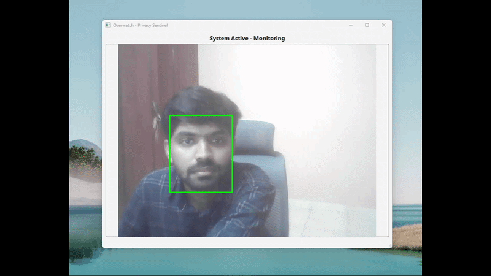

# Overwatch — Real-Time AI Privacy Sentinel

*Real-time facial verification and automated workstation locking upon intruder detection.*

---

## Overview

**Overwatch** is a C++17 workstation security application built with **Qt 6**, **OpenCV 5.0**, and the **Windows API**. It continuously monitors live webcam feeds using deep learning ONNX models and automatically locks the workstation (`LockWorkStation`) when an unauthorized individual is detected.

---

## Technical Architecture: YuNet + SFace ONNX

Instead of generic object detection (e.g., standard YOLO), Overwatch implements a two-stage biometric verification pipeline:

1. **Facial Detection & Alignment (YuNet ONNX)**: Detects facial bounding boxes and 5 key facial landmarks (eyes, nose, mouth) with sub-10ms CPU latency to normalize tilted faces.
2. **Biometric Feature Embedding (SFace ONNX)**: Extracts a 128-dimensional feature vector from aligned facial crops and evaluates **Cosine Distance** against the authorized owner's reference profile (`my_face.jpg`).
3. **OpenCV Native ONNX Engine**: Running `.onnx` models via `cv::dnn` bypasses complex C++ template metaprogramming dependencies (e.g., Dlib) and eliminates MSVC compiler alignment issues across Debug and Release targets.

---

## Tech Stack

* **Language**: C++17
* **Framework**: Qt 6.8+ (MSVC 2022 64-bit)
* **Computer Vision**: OpenCV 5.0 (`cv::dnn`, `cv::objdetect`)
* **Inference Engine**: Native OpenCV ONNX Engine
* **OS Security**: Windows API (`User32.lib`)

---
